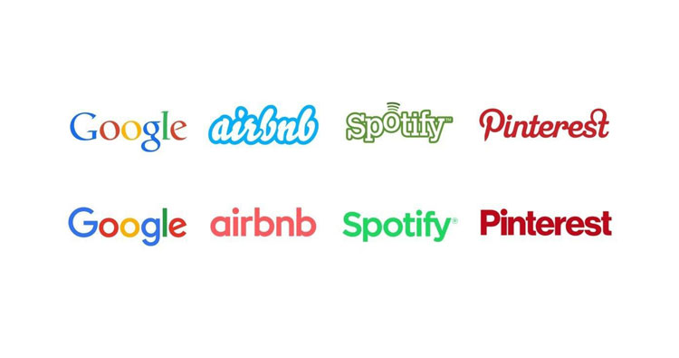

Due to the higher availability of design software it is much easier for businesses and companies to design logos and marketing images. Because of the importance of a brand, businesses have to ensure that their logos are easy to understand and recognise. The coherence of these logos and brands can depend on the typography chosen. 

## Why do businesses rebrand?

A bad logo can affect the reputation of some businesses and may slowly start to become outdated and unrecognisable, therefore a redesign could help save a business's income and popularity. A common way businesses rebrand to appear more modern and professional is by deciding to change their font styles.  

The four brands above are perfect examples of this. All serifs and calligraphy style have been replaced with san-serif and semi-bold fonts making them appear more authorative and simple. The simplicity makes them appear stronger and more serious compared to the previous styles, however their colour paletes remained similar, besides airbnb, so they are still recognisable to their original and possibly new customers.