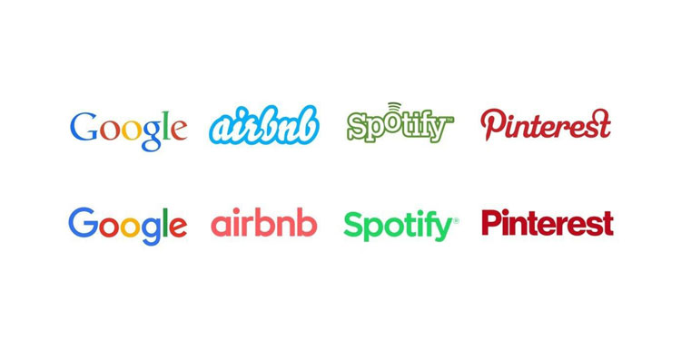
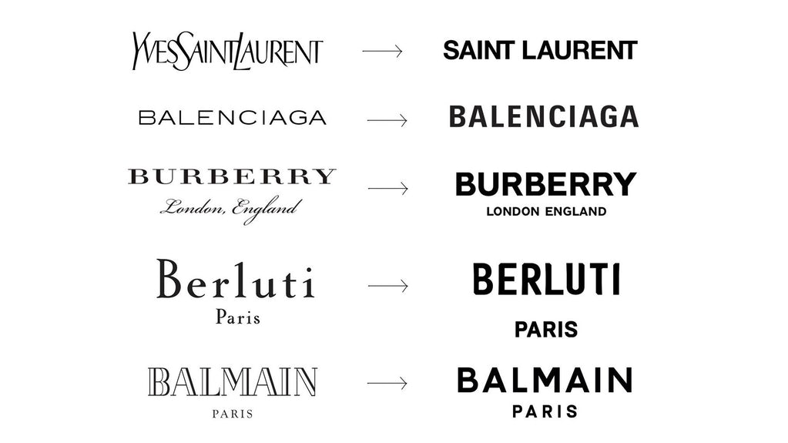
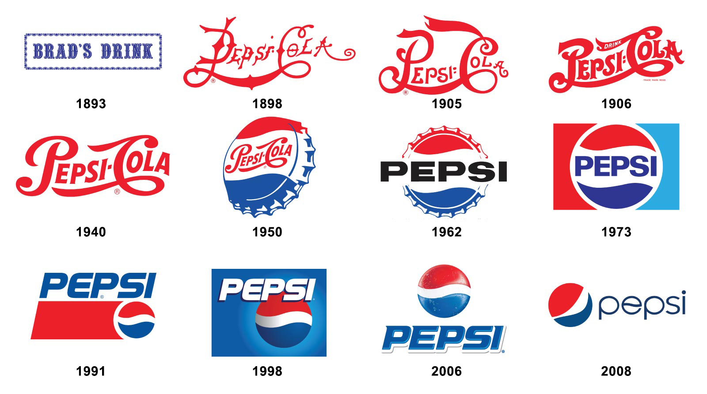
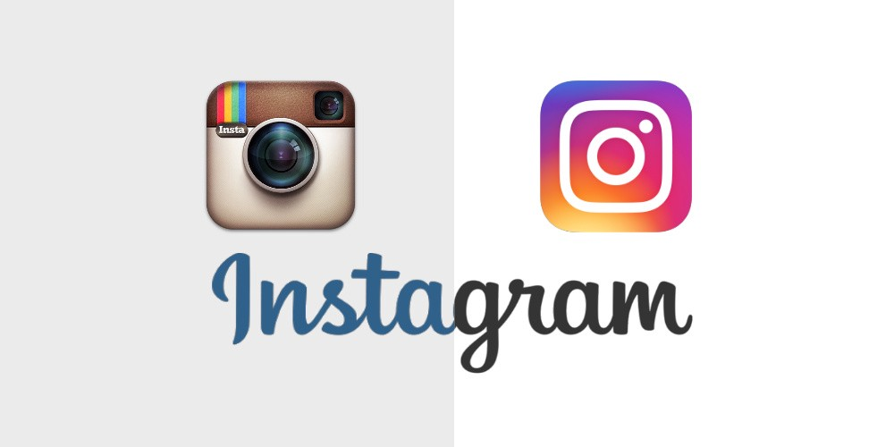

Due to the higher availability of design software it is much easier for businesses and companies to design their logos and marketing images. Because of the importance of a brand, businesses have to ensure that their logos are easy to understand and recognise. The coherence of these logos and brands can depend on the typography chosen.

### Why do businesses rebrand?

A bad logo can affect the reputation of some businesses as they slowly start to become outdated and unrecognisable to some of their audience, therefore rebranding could help save a business's income and popularity. Logos and typography that looks unprofessional and childish can be perceived as unreliable therefore simple font choices can have a heavy impact on the number of customers a business receives.

### Font Styles

A common way businesses redesign to appear more modern and professional is by deciding to change their font styles.

The four brands above are perfect examples of this. All serifs and calligraphy style have been replaced with san-serif and bold fonts making them appear more authoritative and professional compared to the previous styles. Their colour palettes remained similar, besides airbnb, so they are still recognisable to their audience and preserve their personality. This strategy is clearly effective as high end brands associated with luxury acted similarly.

The similarities between these alterations are clear as each of these brands typography has become much sleeker by making the lettering bold and in all capitals, creating a look of purpose. With the lettering being the same height and in all capitals it is easier to read, comparing to the original Yves Saint Laurent typography which could be conceived as more childish with its resemblance to handwriting.

Furthermore, Burberry originally used two different typography styles for the business name and location underneath, although giving the impression of sophistication with the calligraphy style, the two did not fit together. By using the same font for both it signifies that both elements are as important as each other and that they are coherent.

### Colours

A brand that has been redesigned throughout the years is Pepsi. Although their colour palette has remained the same, consisting of red, white and blue, the colour of the typography has switched between them but which one is the most successful? Between 1898 and 1950 the typography was a red, calligraphy style however this design is incredibly similar to Coca-Cola, one of Pepsi’s largest competitors, therefore some differentiation was needed. From 1950 the blue tones began to be incorporated into the brand and is the current text colour, making it an opposite to Coca-Cola. The blue has more calmer connotations compared to the more aggressive red of Coca-Cola and matches the blue used in the circular logo to prove to audiences they are connected. The ‘e’ within the font has been personalised to have a small wave across the middle, as a reference to the previous logos with a wave down the centre of the circle.

In contrast to the match in colours in typography and logo, some businesses have decided to keep their text in black in contrast to their more colourful logos. An example of this is Instagram’s brand redesign in 2016, which transformed its colour palette completely from more reserved browns in a 3D camera to a more elaborate pink, purple and yellow 2D design.

Although the logo was completely modified, the typography has remained similar; the decorative handwritten style could references the personalised and creative nature of the platform and the types of uploads its users post. The transition from blue to black typography may have been used to reduce the friction between the logo and text as the logo is incredibly vibrant and intense so the typography balances this out by being black and reserved. The use of black also creates a sense of professionalism within the app as well as creativity, suggesting its success and popularity.

### Results of a Rebrand

The importance of rebranding is vital when audiences are no longer attracted to the logo as the professionalism behind them is the cause of convincing people to use a companies products or services. The typography must balance with the imagery and colours in order to make them coherent.