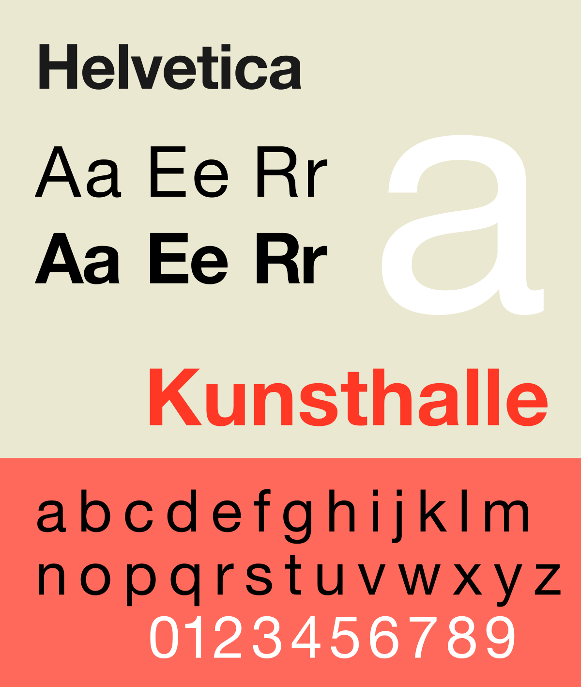

Without realising, whatever you read, wherever you are, every sign, menu, number plate and newspaper has a font type. These fonts are most likely being used in more than one form and have been around for decades. But who designed them and why?

Firstly we must distinguish between what is meant between a ‘font’ and a ‘typeface’ as there is an air of confusion as they are often used interchangeably.

* a typeface is the letters and numbers, the characters that let us put words on the page or screen
* A font however is defined as the complete character set within a typeface, often dependant on size and style. Fonts are also computer files that contain the characters and glyphs within the typeface.

## Classifying Typefaces

There are many families that a typeface can belong to. The most common classifications depending on their technical style are: **serif, sans-serif, script and display**. But they can also be classified by specifications such as proportions and spacing, all together equating the mood they display.

## But Why?

Due to the infinite combinations of font styles with different heights and spacing, serif or sans-serif, their appearance can elicit different emotions. Therefore different businesses need different fonts to convey their personality to their customers depending on their purpose.

## Georgia and Verdana

Designed by Matthew Carter, these fonts have been used for Time, Washington Post and The New York Times. However in recent years Georgia and Verdana were designed for Microsoft as these fonts are suited to be legible even at very small sizes on screens. In 1997 he was awarded the Type Directors Club medal, presented to those “who have made significant contributions to the life, art, and craft of typography”.

The use of Georgia is seen in the articles of The New York Times and Verdana used by Microsoft. Due to the high success and popularity of these two businesses services, these two fonts can now be linked to professionalism.

## Helvetica

Another of the most recognisable fonts which is displayed subconsciously all over the world is Helvetica. It was created in the 1950s by Swiss typographer Max Miedinger. Possibly its most famous use is in the New York City subway system. It was a way to unify the train operations which originally used several different fonts. Its simplicity allows the train riders to easily read and understand destination signs. As well as New York, brands all over the world acquired Helvetica.

These businesses all provide completely different services and products, yet all use the same font style. This demonstrates that we trust this font subconsciously as these logos are attached to successful and recognisable businesses. Helvetica’s simplicity yet boldness connotes authority and confidence which these businesses hope to convey towards their audiences.

## Times New Roman

Finally, another iconic font is Times New Roman, designed in 1931 by Victor Lardent and Stanley Morison and commissioned by The Times paper after being criticised for its poor readability. Because of its design for newspaper it is slightly narrower, allowing the paper to fit more letters per line. The popularity for the font grew after it was used in the daily paper and was used by other printers during that time. Since its original design, Times New Roman has only grown in prevalence, as type setting devices have evolved (computers and software) Times New Roman is always one of the default settings or options to choose from, only enhancing its reach across the decades.

\
So next time you read a sign, newspaper or brand advertisement, see if one of these most popular fonts are being used and wonder how differently you would feel if it was switched with another.