In the movie industry, the advertisements seen on posters or the sides of buses all have particular typography which subconsciously coaxes you to watch the movie, or at least understand its genre. Depending on the theme of the movie, the font style and colours will have been altered to match.

This article will cover some of these popular choices and typographic styles and how they alter depending on the movie themes.

## Technical Typefaces

### Kerning and Line Weight

Firstly, the kerning, which is the adjustment between the letters. Usually a larger space between the letters equals a more dramatic effect as each letter is seen as important as they have more room on the poster. Character names or locations are often displayed like this.

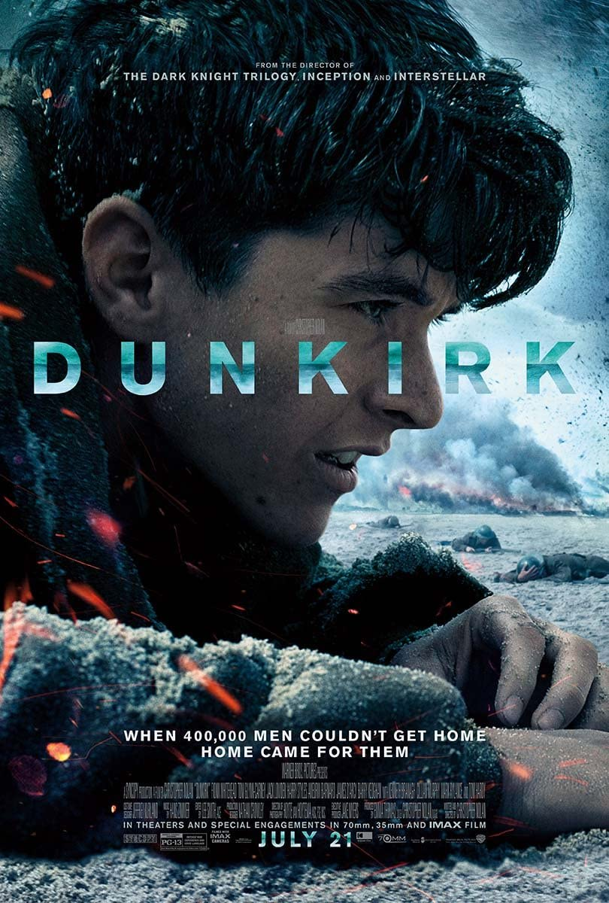

The line weight can also alter the appearance of the typeface as bold fonts can make the letter appear larger but be the same size as another letter next to it with a thinner weight. Certain words in bold are also seen as more important as more attention is brought towards them compared to the thinner text.

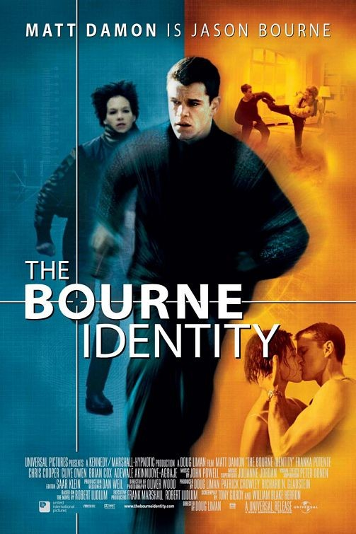

### Sans Serif

Characteristics

* Footless at the end of strokes
* Modern
* Simple
* Higher readability
* Minimalistic

\
Because of sans serif’s simplicity it can be interrupted in different ways, therefore it can be used across multiple genres of movies. Its impact changes greatly when comparing its bold and thin versions. For Taxi Driver, the bold font connotes a more serious tone, possibly danger and action, compared to Jane Eyre which is thin and delicate, matching the femininity theme within the movie.

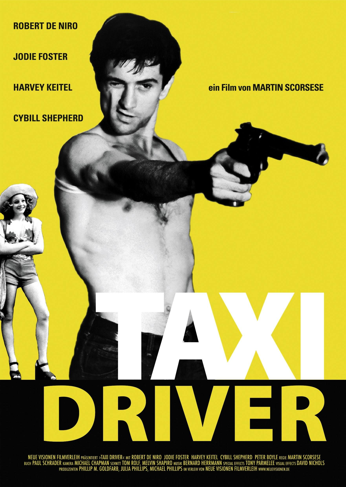

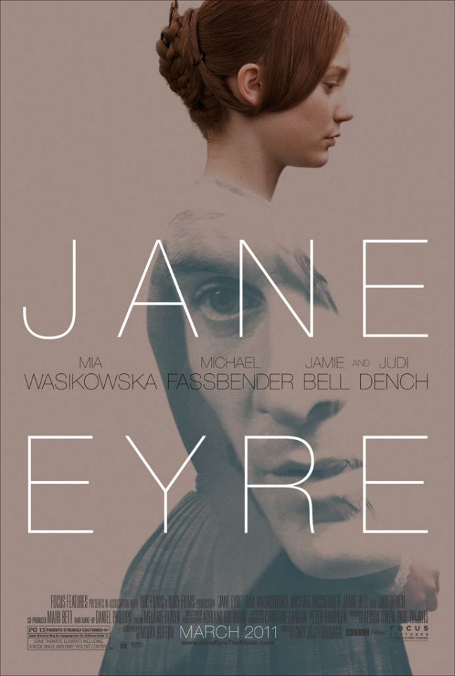

### Serif

Characteristics of Serif typeface

* Classic
* Has a ‘foot’ at the end of strokes
* Easier to set tone
* Weight contrasts between letters
* Easier to distinguish genre: classic/documentary/drama/history?

Both of the posters for The Greatest Showman and Titanic have serif fonts which helps to communicate their setting in the past, magnificence and romantic elements. ‘The Greatest’ font was designed specially for The Greatest Showman film.

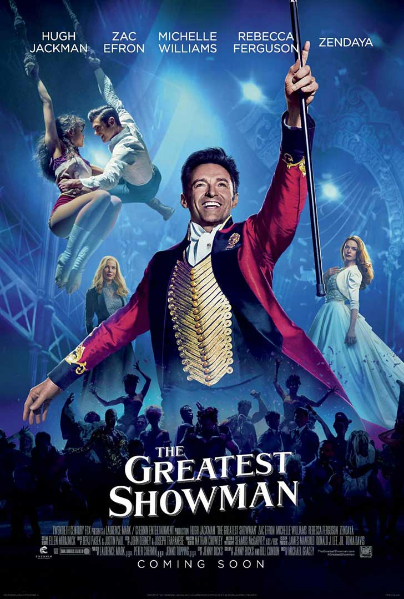

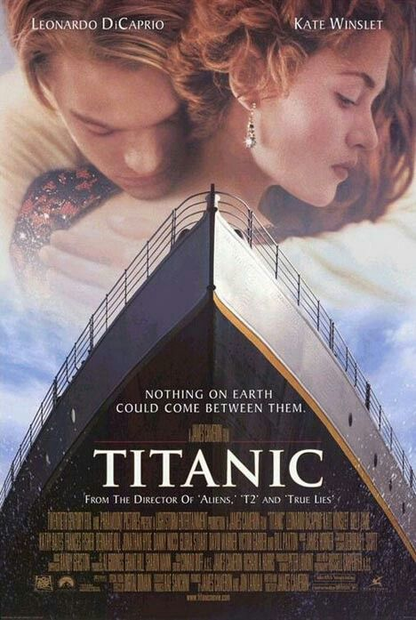

### Script

Characteristics:

* Cursive
* Handwritten appearance - calligraphy
* Traditional
* Elegant
* Possible genres: romance, biography, fantasy

Although they have similar characteristics, the typography for LadyBird and Loving Vincent are very different. The Amador font used for LadyBird is similar to a printed newspaper title, whilst Loving Vincent is a much more handwritten style. However, both films follow the lives of their titled characters showing how this font helps a poster become more personalised helping the audience to understand genre.

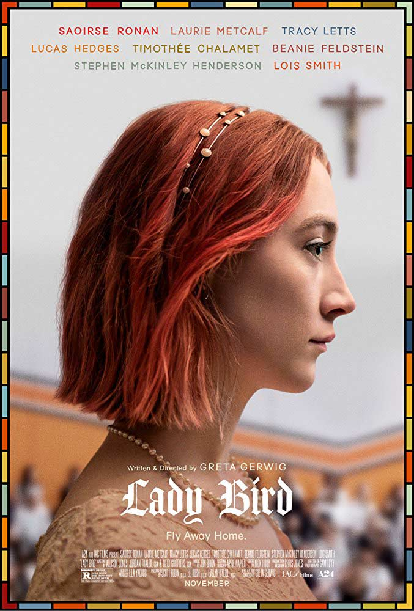

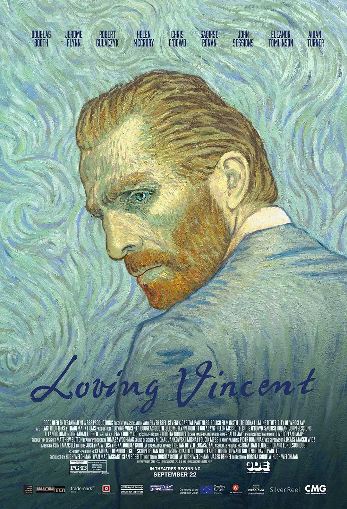

### Descriptive or Decorative

Characteristics:

* Graphic elements
* Individuality
* Unique and creative
* Possible genres: sci-fi and fantasy

Because of their unique styles they are rememberable to audiences. Although they belong in the same typeface group, many decorative typefaces are completely parallel from one another. Often typefaces are made specifically for movies such as the ‘Planet of the Apes’ font being used for the War for the Planet of the Apes franchise.

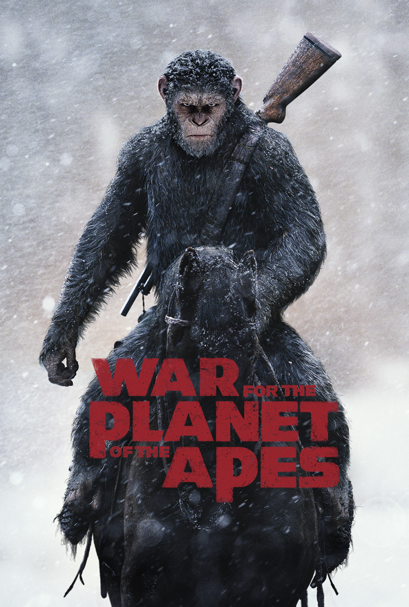

Patents are often added to these fonts too so the franchise can own the typeface so any future media is instantly associated with a certain film. Two of the most famous examples of this is Harry Potter and Star Wars.

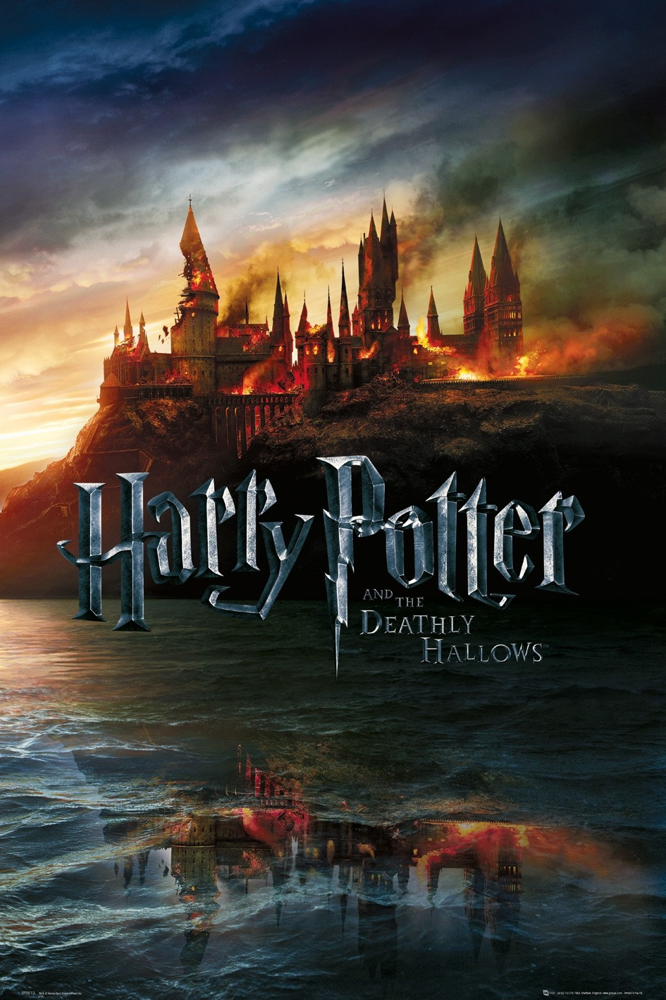

## Genres

### Comedy

Commonly within comedy films the titles are displayed in Arial, Helvetica, Gotham and Futura. It is typically red against a white background making it simplistic but subconsciously recognisable to audiences that it is a comedy. Posters for American Pie and Ace Ventura are prime examples of this.

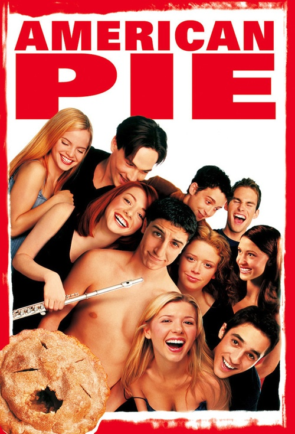

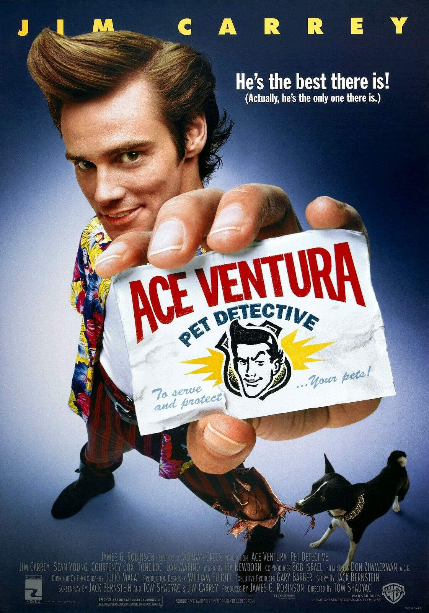

### Sci-Fi

Sci-Fi films could be considered the most easily recognisable typeface on posters. There is often a fluorescent glowing effect around sans-serif font resembling lettering that a futuristic computer may produce. Serifs would suggest a typewriter or handwritten effect, associating with romantic films. 3D elements are also common to highlight the technological aspect of the films.

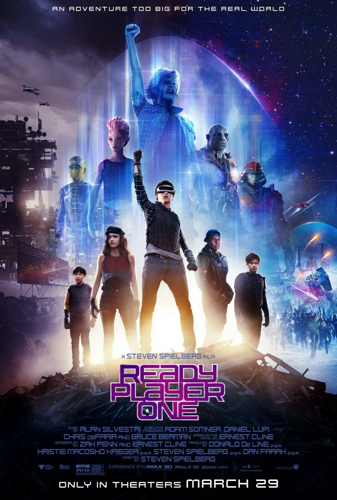

### Action

Similarly to sci-fi, sans-serif and squared typefaces are common. Eurostile and Bank Gothic are popular fonts as well as textures such as shining metals or stone. The all caps and amount of space being used encompasses the action theme and masculinity of the, most likely, male hero. Superhero films are also prime examples of this.

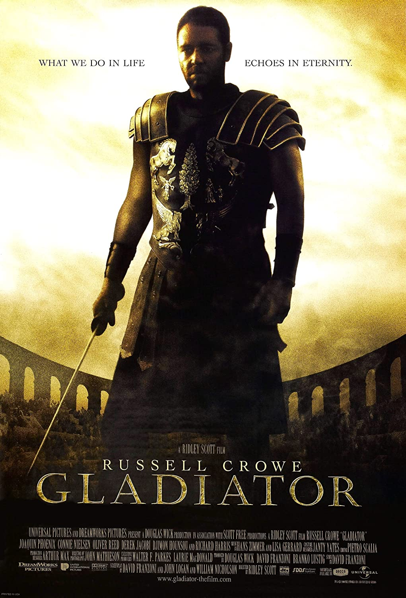

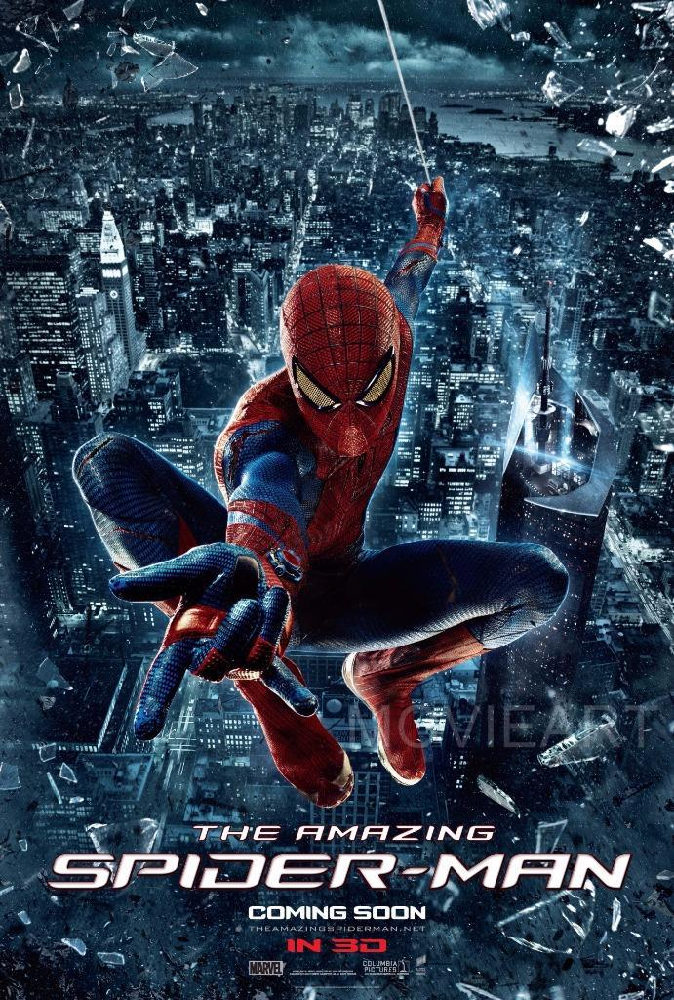

### Horror

Serifs within horror movie posters are extremely common, especially the font Trajan. The thin edges help create an eerie feeling. However, to add another element of fear, the typography is usually in dark colours such as black and red. Shadows are additionally added to create forbidding tones.

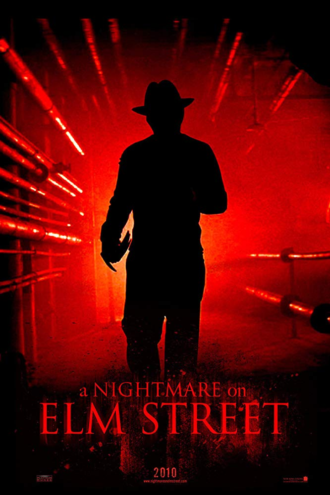

One final element, for the majority of movie posters, across every genre and typeface, all the letters are capitalised. As well as competing for space in front of the more distracting image, the title is arguably the most crucial element so must gain attention too. Did you notice?