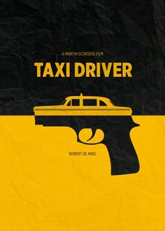

In the movie industry, the advertisements seen on posters or the sides of buses all have particular typography which subconsciously coaxes you to watch the movie, or at least understand its genre. Depending on the theme of the movie, the font style and colours will have been altered to match.

This article will cover some of these popular choices and typographic styles and how they alter depending on the movie themes.

## Technical Typefaces

###### Kerning and Line Weight

Firstly, the kerning, which is the adjustment between the letters. Usually a larger space between the letters equals a more dramatic effect as each letter is seen as important as they have more room on the poster. Character names or locations are often displayed like this.

The line weight can also alter the appearance of the typeface as bold fonts can make the letter appear larger but be the same size as another letter next to it with a thinner weight. Certain words in bold are also seen as more important as more attention is brought towards them compared to the thinner text.

###### Sans Serif

Characteristics

* Footless at the end of strokes
* Modern
* Simple
* Higher readability
* Minimalistic

\
Because of sans serif’s simplicity it can be interrupted in different ways, therefore it can be used across multiple genres of movies. Its impact changes greatly when comparing its bold and thin versions. For Taxi Driver, the bold font connotes a more serious tone, possibly danger and action, compared to Jane Eyre which is thin and delicate, matching the femininity theme within the movie.

###### Serif

Characteristics of Serif typeface

* Classic
* Has a ‘foot’ at the end of strokes
* Easier to set tone
* Weight contrasts between letters
* Easier to distinguish genre: classic/documentary/drama/history?

Both of the posters for The Greatest Showman and Titanic have serif fonts which helps to communicate their setting in the past, magnificence and romantic elements. ‘The Greatest’ font was designed specially for The Greatest Showman film.

