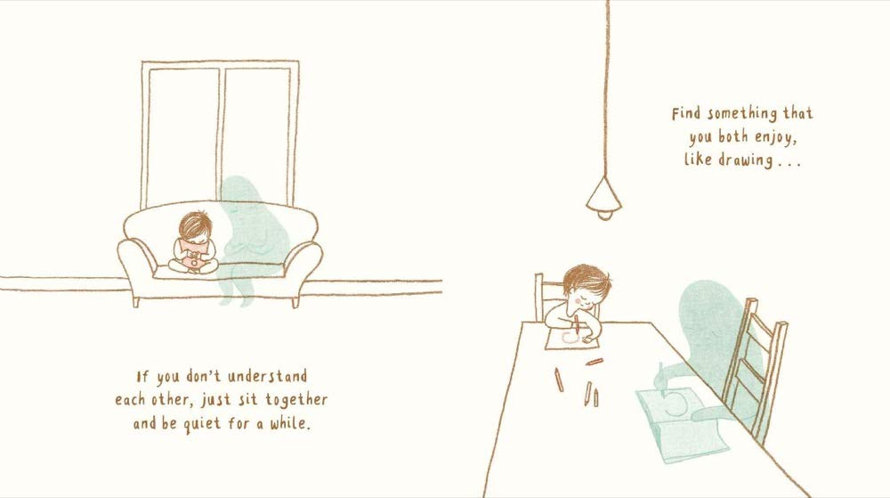
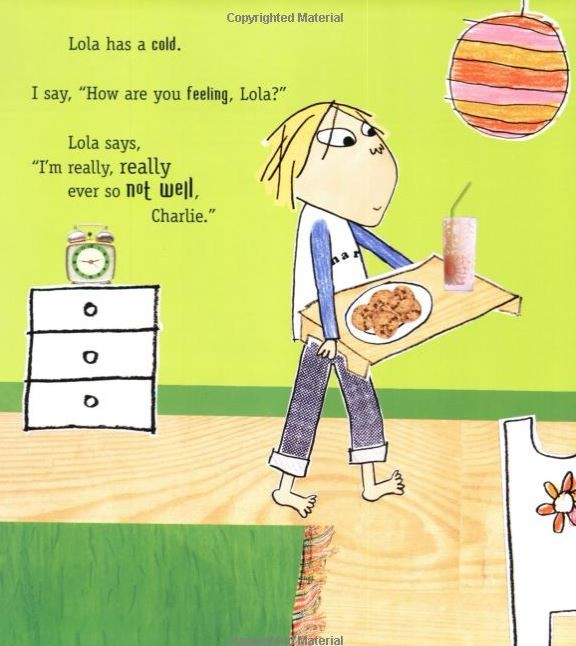
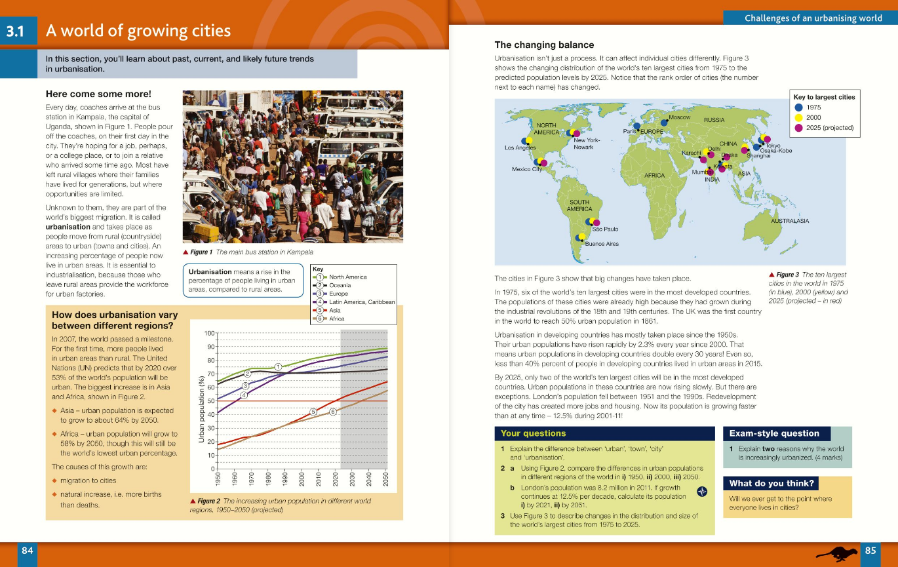

The typography used in books is dependant on an abundance of factors such as budget, genre and audience. But what are the key differences between books aimed for children versus adults?

### Adults and Fiction

Usually with a smaller the print size, more characters can fit onto one page, therefore less pages need to be printed, reducing the cost. The minimum print size for readability is 9pt so anything smaller will be difficult for audiences to decipher but would increase profit margins. Larger font sizes would allow those with more limited sight to read more easily but be more costly. The most common font size within books is 11pt so there is a balance between readability and page numbers. This typography is clearly more suitable for older audiences as large paragraphs of text need a reader with a higher attention span and can focus on smaller sizes.

Books with a more serious subjects in fiction stereotypically have a serif font where the author wants to be perceived as an expert on the subject. Thus, these are also more likely to be longer in length, with a higher volume of pages with unbroken text (without headings and subheadings). For fiction, Baskerville and Caslon are timeless and popular choices, so seen as reliable, and carries its readability when set to a smaller size which is common in this genre. Because serif fonts were the first type to be used in commercial printing they offer a more traditional feeling and more professional tone so the reader can take the story more seriously, even if it is fiction. 

I believe that a fiction piece in a sans-serif font would appear more computerised and impersonal, removing the element of believabilty from the characters or narrator which is crucial in the success of a fiction book. 

### Children and Fiction

On the other hand, for children, who often begin to learn more visually, book pages are mostly illustrations with text dotted more sporadically on the edges. The font is also much larger, an average between 16pt-24pt which allows them to follow more easily with the adult they’re listening too. Fewer words also help keeps their attention as there is less to focus on. The typeface is also usually serif, script or decorative as it looks more fantastical and personal to the character which appeals more to younger readers. A sans-serif font would seem more professional or ‘boring’ to a young child therefore losing the attention of the young reader.

Lauren Child, the author of the Charlie and Lola and Clarence Bean series, has a very personalised style of typography. There is a mixture of typeface styles, sizes, and use of capital letters. This style transforms the personalisation of the characters, making it more fun and visually pleasing for the children, matching the illustrations. The use of bold for particular words also varies, helping to show their tone for the reader, in adult books italics is used to create emphasis.

If books for adult fiction used the same typography as Lauren Child, it would be very disorientating and harder to distinguish individual words as they would morph together or overlap if the size was reduced. It would be difficult to take an adult novel seriously with a mixture of typefaces and fonts for individual letters.

The larger typeface size also helps to increase the number of pages used. If the text was displayed to fill the page it would be incredibly monotonous for its audience, therefore very unsuccessful. Although more expensive, more pages have extra illustrations which the children learn more through at that age. 

### Young Adults and Non-Fiction

For textbooks, I believe that sans-serif typefaces are much more suitable as it has a much cleaner appearance. A more professional and expert typeface  is critical when reading non-fiction, as it encourages the reader to believe what information they’re absorbing. Although serif font is older and more traditional I think it ruins the authenticity of the facts as it usually is catered for fiction. These san-serif typefaces used in large blocks of text is very unappealing to very young children, despite the fact that they would struggle to understand all of the words, the style of the typography is also not suited to them, instead older school children (aged 12+) would be able to appreciate the executive and factual genre of the book as they know it is not a story.

Next time you read a novel or a textbook, image its parallel typography. Would it look better in sans-serif or script? Would it change the emotions you relate to it?