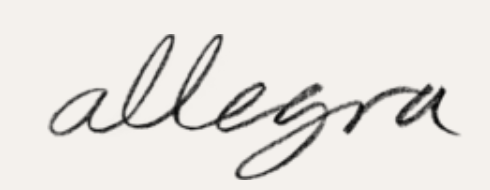

## Logos

Fast food restaurants such as McDonalds and Burger King’s typography and branding is extremely opposite to more high end dining restaurants such as Allegra and Céleste in London. These examples help to embody the stereotypical typography of different forms of restaurant. Firstly, the fast food chains and more distinguishable by their sans-serif and bold font, this is part of the strategy that allows customers to see them on a busy high-street.

In addition to this, the colour choice of the typeface is a contrast to the background colour, another attention grabbing technique. As you can see from the multiple examples below, red and yellow are the most popular choices, especially for American chains, however as long as the colours contrast each other, they remain eye-catching and strong. The bright colours however do create more child-like imagery and less professionalism, though the customers are aware that these restaurants do not produce Michelin star worthy food.

In contrast to this, more luxury dining venues do not need as bold colours or fonts as customers preplan these meals, they’re far less impulsive than fast food companies. Due to this, their colour tones are much less vibrant, gentle browns and white and black contrasts help elevate their brand of sophistication. Their typefaces are also more often serifed or scripted to add the feeling of elegance which is vital for adding value to the setting. The calligraphy style used by Céleste and Allegra helps add a personal yet traditional tone.

## Menus

For the menus, similar patterns emerge. For fast food, McDonalds for example, the bold sans-serif font is continued, as well as maintaining brand it is increases clarity when displayed on a screen as they have no printed menus, therefore readability is key.

Another distinguishable element to note is that, when displayed on a screen, pictures of the items appear too. This increases further the impulse buys from the customer, however further removes the professionalism.For Allegra and Celeste on the other hand their traditional, high quality typefaces continue to their menus.

The typeface is much smaller compared to the fast food chains because it is printed for the customer therefore will be closer for the readability. The dishes being bold on the Céleste menu helps to differentiate from their descriptions as they are clearly the more important element of the text. The use of the serifs matches the emotions of the crown logo that Céleste also uses, royalty and tradition. For Allegra the serifs and small typeface also help to present high quality and worth. Although, instead of using a bold font the types of dishes are capitalised and enlarged to determine. Both menus clearly demonstrate that they are much more professional and use food as an art form, communicated solely by their typography.

\
Key elements of fast food branding:

* San-serifs
* Bold
* Contrasting colours (red and yellow)
* Use of pictures
* Increased readability
* Bigger font sizes

Key elements of fancy dining branding:

* serifs
* Narrow or italics
* More monochrome (hints of gold for luxury)
* No pictures (more professional)
* Smaller font sizes

\
So, again typography has proved that the elements that you mix allow you to communicate the nature and purpose of any business. If the elements were swapped would you be able to identify which brands belonged to the different sides of dining?