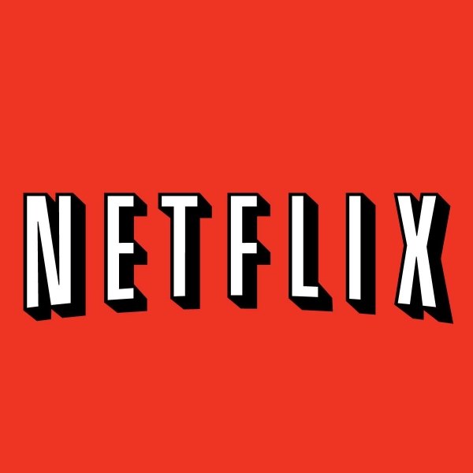
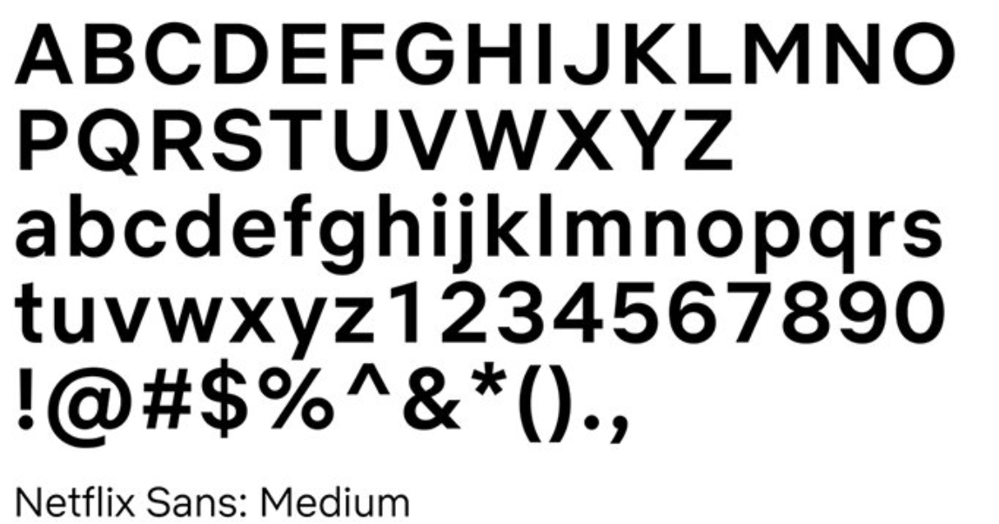
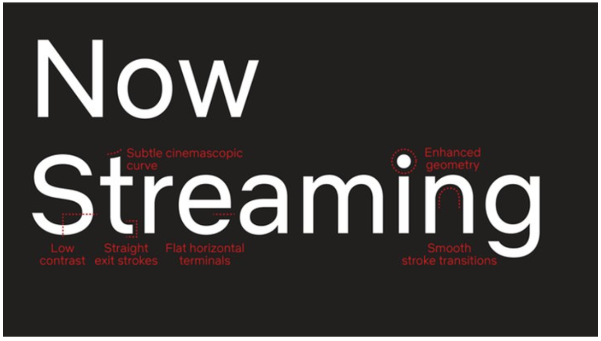
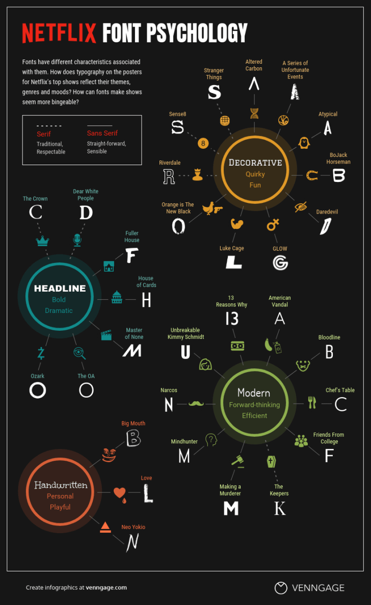

Netflix is the new internet giant for film and tv show streaming, generating an operating profit of $2.6 billion in 2019, increasing every year from its establishment in 1999. As well as offering movies made by Hollywood giants, they also have started to create their own shows naming them ‘Netflix Originals’. 

## Logos

Until 2014, Netflix had a logo containing the typeface Graphique, designed by Hermann Eidenbenz in 1945 then digitised by Ralph M. Unger.

The use of the black shadow on the characters creates a comic effect through the boldness and 3D appearance. This, as well as the colour red, helps to communicate the service that they provide, a source of entertainment. The use of white on the red background also creates a bold contrast which attracts the eye. The capitalisation of the font also suggests the movie genre, with the similarities of the Hollywood sign.

As of 2014, the new logo switched the colours creating a black background and red typography. I believe that the black background creates a more sophisticated tone, which can help viewers associate a higher quality service to Netflix as the original red comic background was could suggest a younger target audience. Black can encompass all ages as well as being professional. The red ’N’ is formed by a red band which folds over itself with a drop shadow, which could link to the red carpets of the movie world, or a strip of a celluloid film.

The rest of the logo maintains the red, sans-serif font. Without the shadow, compared to the previous logo, the typography looks sleeker with clean edges and no serifs.

## Netflix Sans

As of 2018, Netflix also revealed a new custom typeface, ‘Netflix Sans’ developed by an in-house team with Dalton Maag, to be used across the streaming platform. The transition between the typefaces was coaxed by the increasing costs, as font licensing can become expensive, and ability to make the brands identity more ‘ownable’, so developing a typeface created a unique element for the brands aesthetic. The leader of the design, Noah Nathan, revealed that the typeface’s uppercase proportions were designed to appear “cinematic” and the lowercase proportions “compact and efficient”. The arched curve on the lowercase ’t’ is inspired by the “cinemascopic curve” of the brands extended logo.

As well as their logo, the font psychology continues to the typefaces they use for their poster advertisements on the site. The typography used for their films and shows helps to attract audiences depending on their preferences for genre.

Please read one of my previous articles to discover more on how different typefaces can illicit different emotions to match the genre of movie being advertised.

During the corona pandemic an additional 16 million accounts were made. Netflix's brand was already hugely dominating in its market but now its typography will have become more widely recognisable due to the large number of people it has reached, this in turn will continue to build its already extremely successful and popular brand.