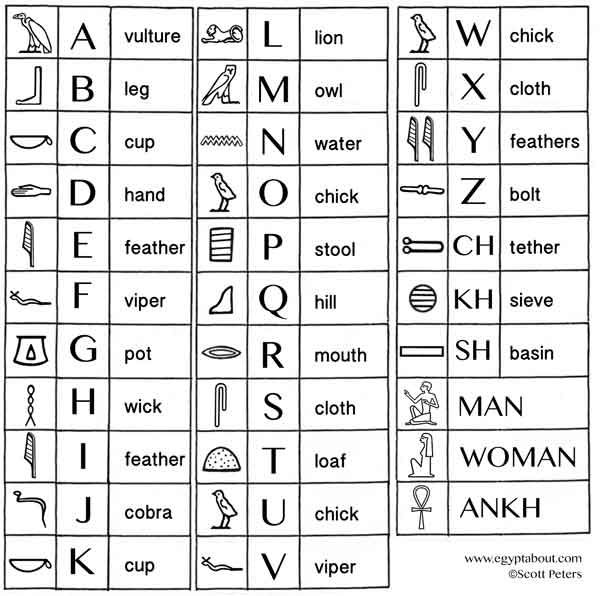
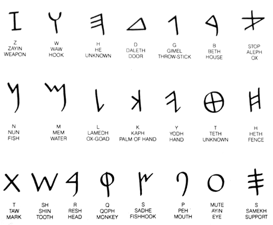
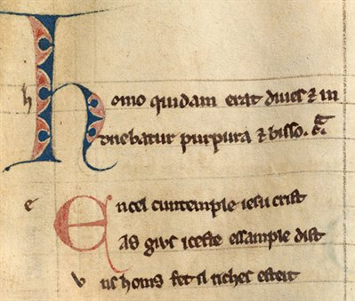
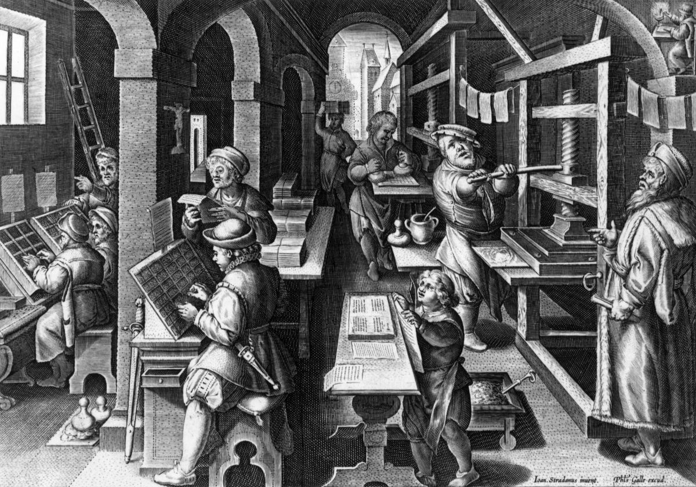
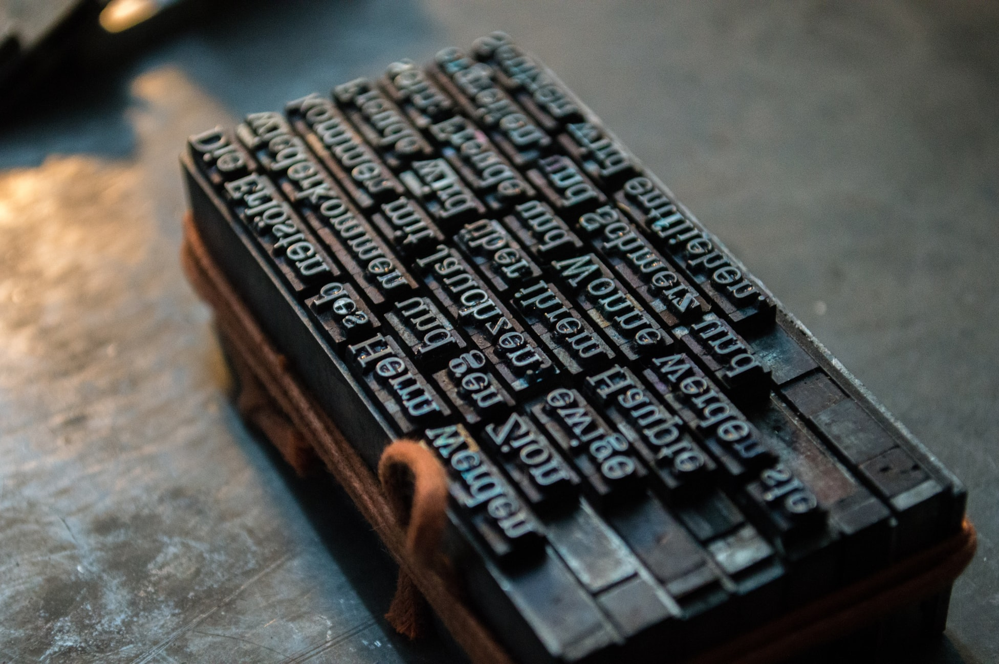

In 3000BC before the alphabet we use today was created, in the times of the ancient Egyptians, carvings in stone is how they told their stories. Hieroglyphics. 

Although hieroglyphics are Egyptian, the word hieroglyphics is from Greek origin; “Hiero” meaning “holy” and “glyphics” meaning “marks” or “writings” – so the together they mean “holy writings”. Although our modern alphabet is only twenty-six characters, there were up to one-thousand distinct characters in the hieroglyphic alphabet. Some symbols represented single letters, whilst others represented multiple that made sounds such as ‘sh’ or ‘ch’. Syllabic signs represent a combination of two or three consonants. Despite the large volume of characters available, there were no vowels or punctuation.

To make them harder to distinguish, the direction they’re read depends on the direction that the people or animals are facing. If the animal is facing the right, it is read from right to left. If facing the left, it is read left to right, how we do modernly. 

Later in 1500BC the people called the Phoenicians (where we later derived the word phonetic) found it difficult to communicate with other colonies they met whilst travelling. They decided to use the idea of using symbols to represent sounds instead of objects and communicate through written form. 

Their simplicity allowed the people to carve these into stone more easily as lines and circles are less advanced shapes to carve. However in 100AD when parchment paper and animal skins could have been used to write with inks, the characters could become more advanced but still emulated the original cuttings from stone. 

Moving forward through to the thirteenth century when parchment paper was still in use, the ability to print scripts was incredibly slow due to the lack of technology that we have available today. Each piece of writing had to be created by hand, usually by monks with quill and ink. 

Eventually in the 15th Century technology began to catch up, with the use of printing presses, larger numbers of characters could be printed in a shorter amount of time. It was still manually worked however with a crank needing to be pulled down in order to print. Until the steam powered press was invented (in 1814, 360 years after Gutenberg’s press), the printing press required manual labour. 

There was a lot of waste with the manual press as a cast of each individual page had to be made, so after it was printed in the volume needed, the plate would not be needed again. In solution, the letters were individually cast so that they could become interchangeable, allowing the letters to be used indefinitely and could cater to every kind of printing requirements. This was named moveable type. 

The terminology that we use today, ‘uppercase’ and ‘lowercase’ refers to where the uppercase letters were stored in the drawers of the printing press. The lower case letter casts where in the drawer underneath. 

Due to the fact that the letter casts were made by blacksmiths, they discovered they were able to craft the letters in different styles, creating more distinct typefaces that are still recognisable today such as Garamond, Didot and Baskerville.

\
As the centuries and decades have moved on the creative aspects of typefaces has developed, serif and sans-serif, script and decorative have all been explored. We use and see them everyday but technology has allowed us to produce them with far more ease that the manual effort of carving stone or printing presses. However typography would not be the same without them.