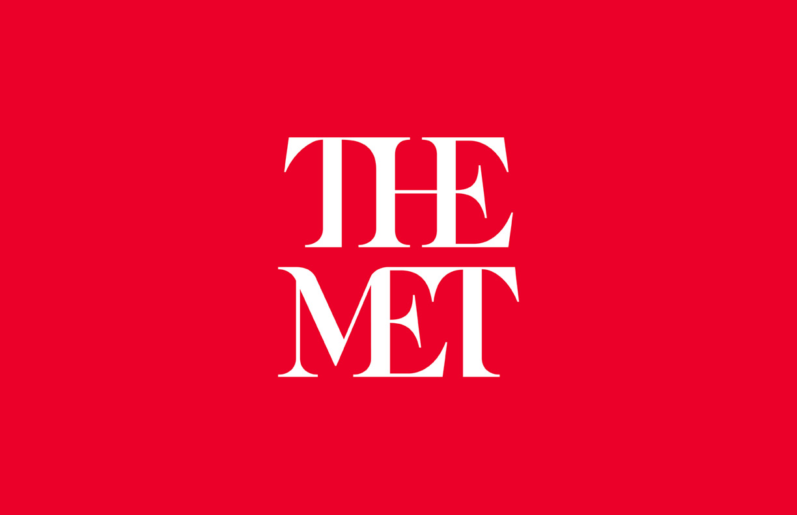
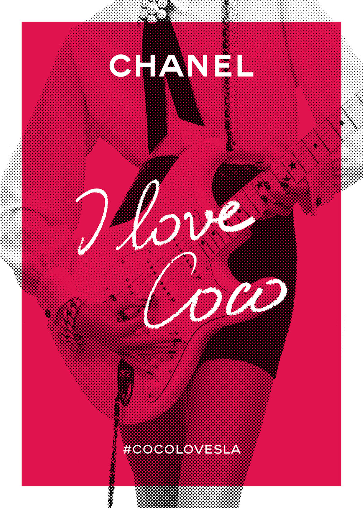
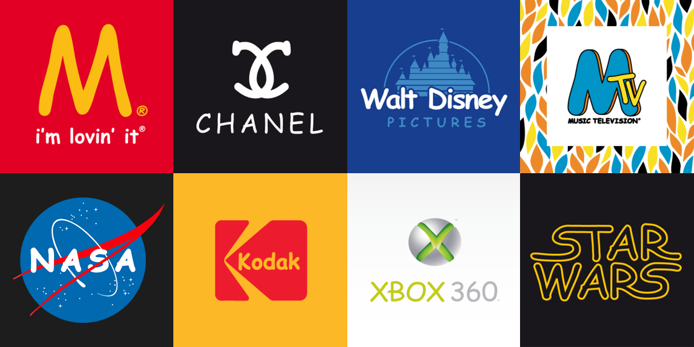
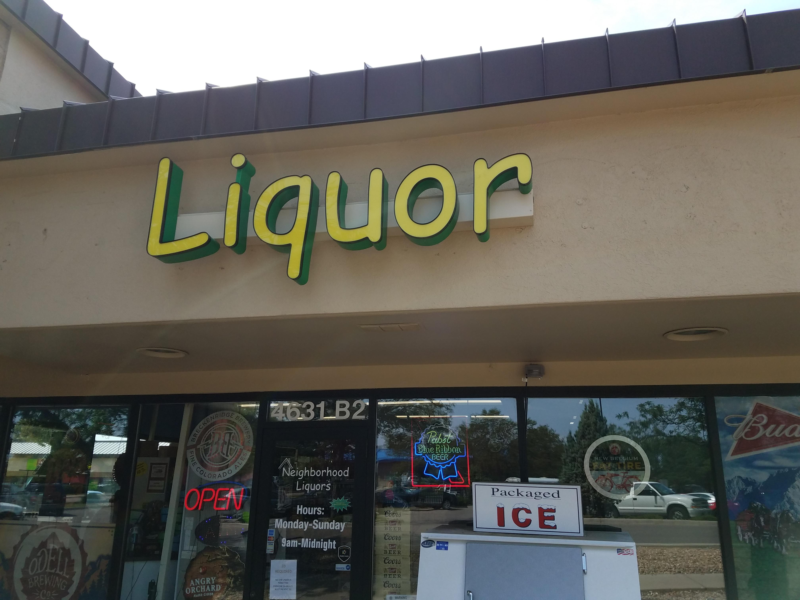
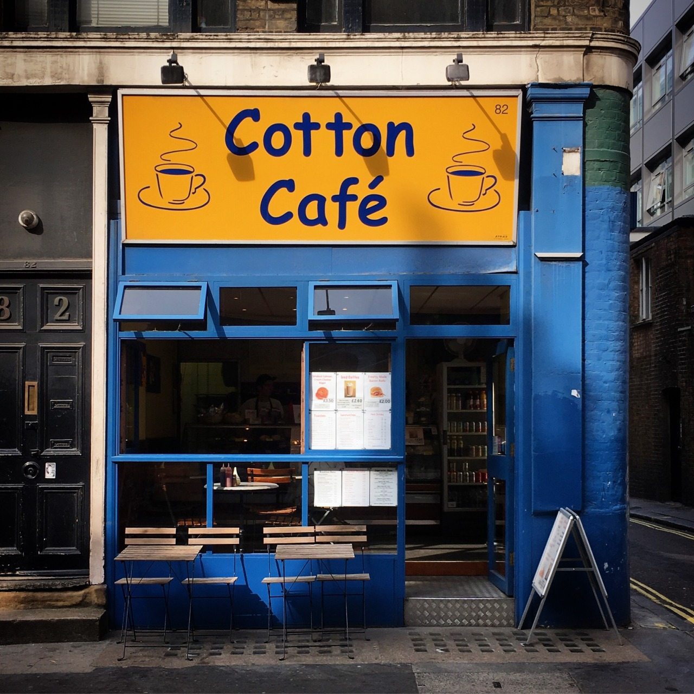

In order to create a successful brand and image, the coherency of either the logo or typography must be maintained.  Unfortunately some companies miss the mark with this with a poor design, making their typography confusing, illegible or not communicating the purpose of the brand. 

The first example is The Met logo. The Metropolitan Museum of Art Is the largest art museum in America Located in New York, it is the fourth most visited art museum in the world. 

With the use of a serif typeface and the blending of the letters, to some people, especially those with dyslexia, it becomes more difficult to distinguish individual letters as the melt into each other. It takes more concentration than it should in order to read. The serifed artistic style does match the purpose of the museum however for the main element of the branding it should have been more legible. Only the bold contrast between the white and red makes it easier to determine as the colours do not blend together. 

The importance of typeface is further emphasised by this poster for Coco Chanel.

The typeface for ‘CHANEL’ is maintained from their original branding, san serif and capitalised, however the script, calligraphy type face used for the slogan ‘I love Coco’ has failed to be fully legible as the typeface has made second ‘co’ appear to be a ‘w’, therefore at first glance the poster reads ‘I love Cow’. This removes some professionalism as spectators will mock instead of want to buy the products, simply because of poor design. The script typography has been used to add an element of personalisation for the audience however different font weight or kerning could have made the lettering more distinct. On the other hand, the poster could have maintained the sans-serif, bold typeface used throughout the rest of Chanels branding so it would be more visually cohesive.

One of the worst marketing choices a business who wants to be taken seriously can make is using the Comic Sans typeface. Its appearance is very child-like with a slight hand written aspect despite it being sans serif. When displayed in businesses it is never taken seriously by customers or associates so is likely to reduce the amount of sales as customers are less likely to buy there. If you replace famous typefaces with Comic Sans, it instantly reduces their credibility.

These small businesses decided to use Comic Sans for their branding. Do you think that you’d trust the professionalism of the service or products? Would they become a more established brand if they changed they’re typeface?

For the Cafe, an elegant serif typeface would be more suitable to show the sophistication and warmth that is often associated with coffee shops. Or a calligraphy typeface could have been used to define the personalisation of the store as it is not a chain. A bolder and capitalised typeface would have been more successful for the liquor store, representing the strength of alcohol and would be less appealing to children which the comic sans currently indicates. 

The wrong typography can severely impact the success of a business and its marketing strategies, design is such an important element to create interest and coherency which helps to attract customers and make them trust the business and the brand they’re trying to convey.