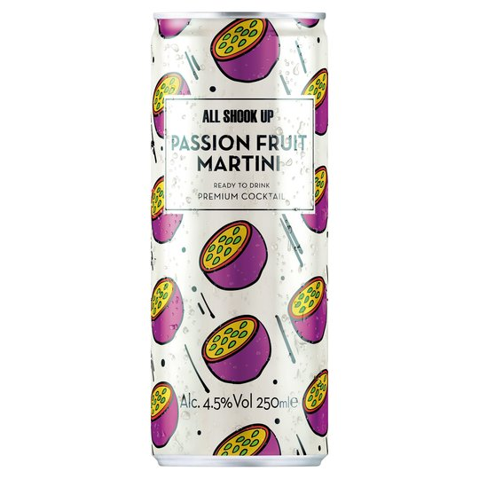
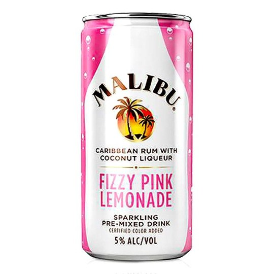
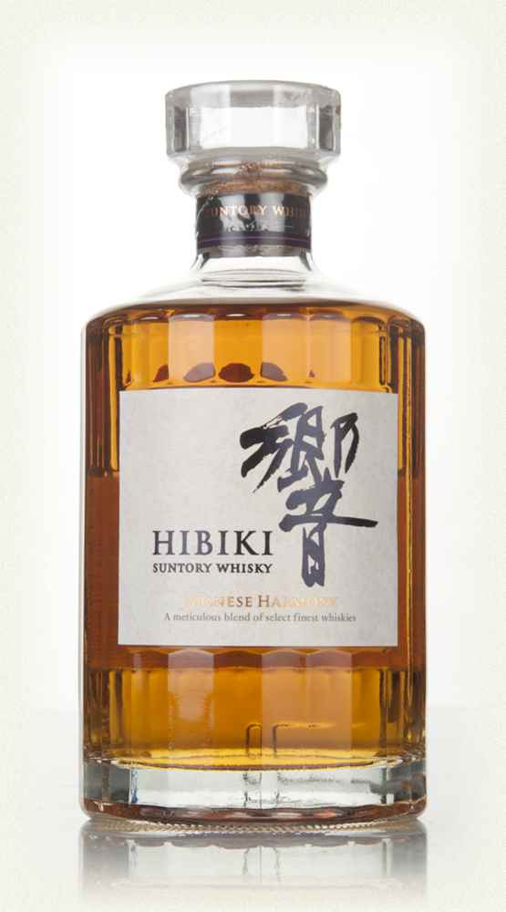
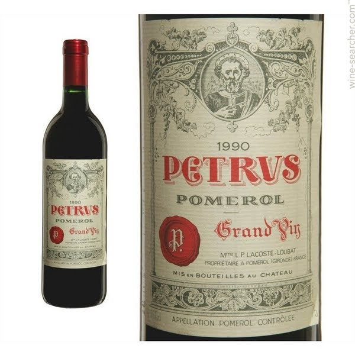
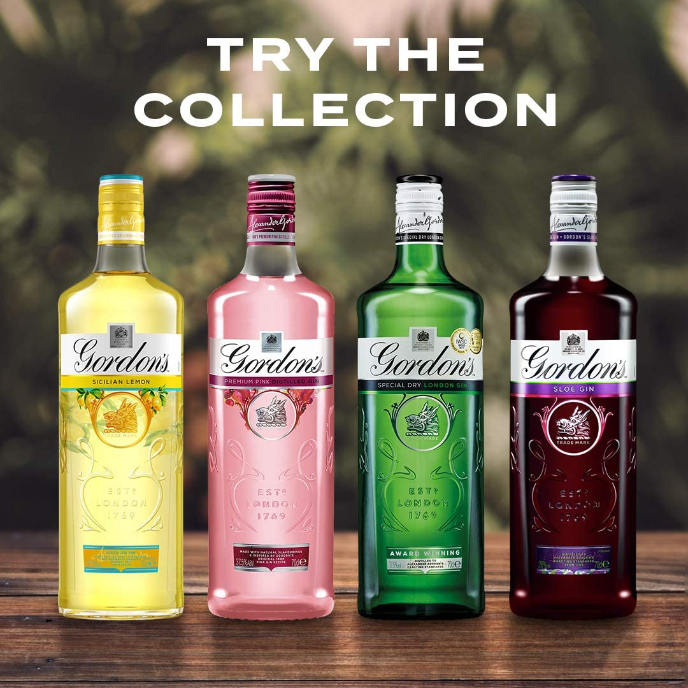
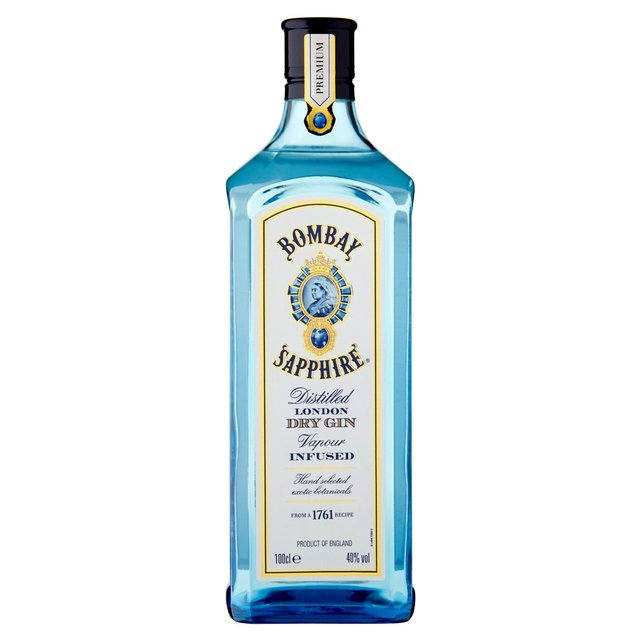
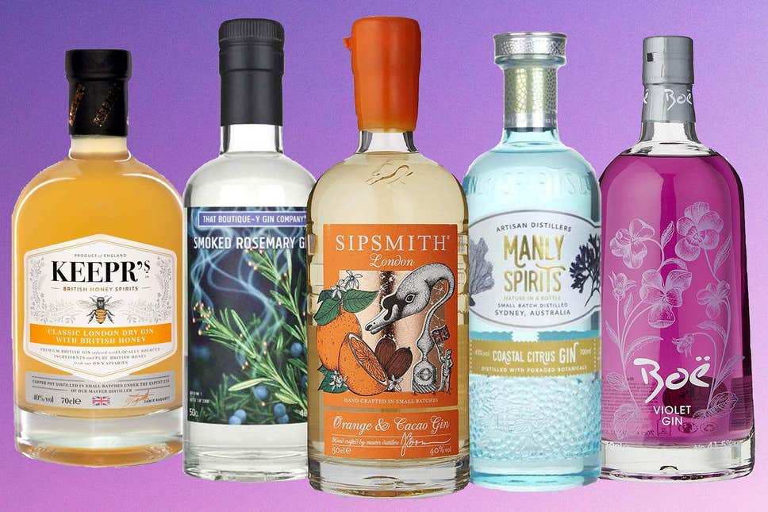

Particular alcoholic drinks have different connotations depending on their flavours and audiences. Cheap, fruity drinks are usually targeted towards younger people, possibly more specifically female. And older and expensive whisky or wine will be more appealing to more mature audiences. Their typography helps to reflect this. 

For small, canned drinks, the price is easily identifiable as cheap. This immediately attracts the younger audiences, as does the typography. The sans serif removes the traditional and elegant implications making it more modern and youthful compared to a serif font. The capitalisation also helps to attract attention to counter the small size of the can. The colours used on both cans is also used to attract younger audiences, again possibly female, as the pinks and purples are more jovial and unprofessional to match the flavours of the alcohol advertised. By the branding choices, it is easier to identify the cheaper market they are from. 

On the other hand, for those with slightly more expensive tastes, serifed fonts helps portray the sophistication and luxury branding to match the alcohol. The more minimalist colour palette for ‘Hibiki’ whiskey is black and gold which helps to promote the luxurious nature, as gold matches feelings of royalty and refinement. The minimalist black creates a contrast that isn’t overwhelming but maintains the elegance. For the ‘Chateau Petrus’ wine, which can reach prices of £2600, a script typeface has been selected which appears to be originally hand crafted due to its originality and decorative style. This personalisation adds to the feeling of age associated with the wine. Due to the typography choices of both of these bottles it is easy to identify that they are in the more expensive range. 

According to Kantar’s Worldpanel division, gin has overtaken whiskey as Britains favourite spirit. Over a quarter of the population purchased gin over 2019, with an increase of younger customers (between 18-24) rising to 55% becoming fans. Due to its increased popularity, there have become many competitors in the market. I believe that the branding and typography is the most decorative within the alcohol industry due the thousands in production around the world, so how to the stand out on the shelf?

‘Gordon’s Gin’ is possibly one of the most famous gin creators, more recently a higher volume of flavours have started to be delivered to the public. 

The script or calligraphy typeface is iconic to the brand now. It’s importance is evident through the size of brand name being larger than the label of what the product is. I believe that the handwritten appearance is in acknowledgement to the personalisation that gin has with the customers choice of tonic water or fizzy drink. A more sophisticated atmosphere surrounds the bottles as gin is more refined than other alcohols such as vodka. The use of colours to match the flavours shows the diversity that gin can have and demonstrates more creativity. 

Another close gin favourite is ‘Bombay Sapphire’. It’s slightly alarming blue colour could link audiences to the cheaper ‘WKD’ which could be damaging to the brands reputation, however the typography helps to save this. 

With a serif typefaces, the notion of luxury is restored. It immediately increases the appearance of quality within the drink. If the colour wasn’t enough to draw attention, unlike Gordons, the title is capitalised, as is most of the text, making it bolder and more authoritative next to its competitors. The mixture of blue and gold colouring communicates a serenity and opulence. The smaller text with calligraphy typefaces increases the sense of maturity that the blue may have removed. 

Within the gin family, (although not in all) serif and decorative fonts are incredibly popular, I think it is to help communicate the personalisation element of the drink.

Overall, alcohol linked with higher quality will be worth more so the typography has to reflect their price. The script fonts are extremely common amongst expensive drinks aimed at older ages therefore drinks aimed for younger audience will more commonly see sans-serif font along with brighter contrast colours.