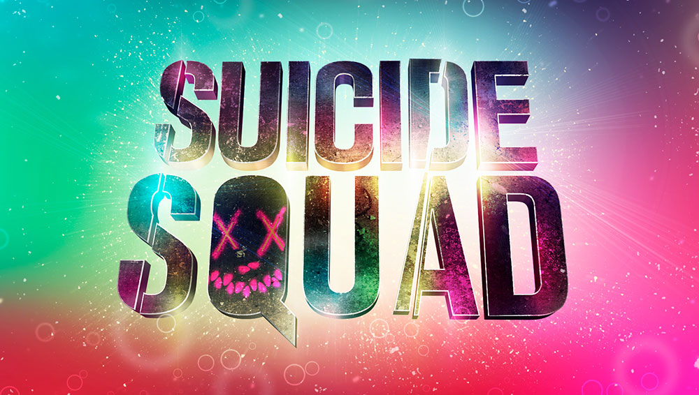
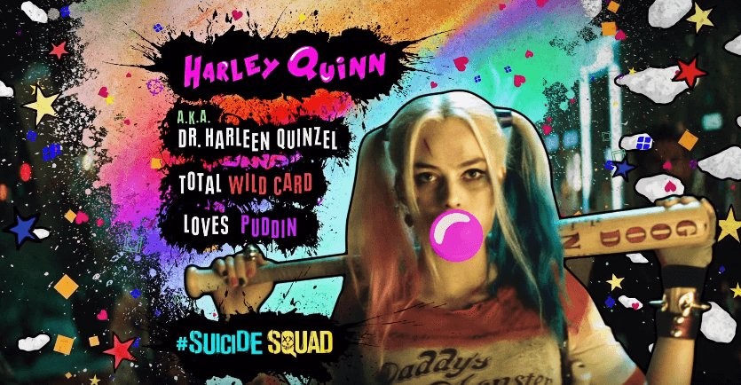
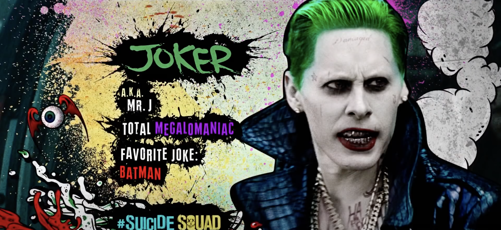

The highly anticipated 2016 live action version of Suicide Squad received a mixed reception of love and hate. It is shocking that with a song such as Bohemian Rhapsody in the sound track the film managed to disappoint audiences. However the art styles used in the promotion and character introduction sequences were very aesthetically pleasing and a good marketing decision by referencing the original comics. 

The signature logo typeface was created specifically for the film. Bold and sans-serif to match the action theme with an additional decorative slit through the ‘S’, ‘D’ and ‘A’ characters. The Q is a particularly decorative character with a face used instead of the closed counter space. These elements help to show the personality behind the characters, but the additional vibrant colours in the background also show the contrasting but powerful identities of the characters. The use of metal being used is a common element within action and superhero movies (as discussed in a previous article). 

The members of the squad is what held promise for the film however the story line could not match. For social media, introductions of the members held a still frame after comic themed graphics, with decorative typefaces for exposition on their likes and abilities. 

### Character Introductions

<iframe width="560" height="315" src="https://www.youtube.com/embed/XXMrXyA3Yp0?rel=0" allow="accelerometer; autoplay; encrypted-media; gyroscope; picture-in-picture" allowfullscreen></iframe>

The still frames typography is very interesting with varying colour choices and typefaces depending on the characters, for example, Harley Quinn:

Each of the characters typefaces for their names are unique, for Harley Quinn the bold, bubble type choices represent her quirkiness and likability as she became a quick fan favourite. The use of pink is to match her gum which she is often associated with, as well as hinting at her childlike behaviour and the section of her iconic hairstyle. The pink shades follow through to the facts with red and purple to represent her femininity. The typefaces for the ‘A.K.A’ and facts do not rest on a straight line creating a jagged effect matching the comic style as well as the unpredictability that the characters possess as they are not the heroes, instead the villains. 

In contrast, her boyfriend The Joker has more of a script typeface appearance like he wrote it himself. It seems more scrawled than typed, matching his unhinged nature and in a green shade to match the boldness of his hair. Other colours that he is associated with such as his purple suit and bright red mouth are continued down into his personal facts. 

I believe that the branding behind the film was more successful than the storyline itself which is why it was a disappointment to some. The use of typography helped to create such a strong character around the genre of the movie. The aesthetics matched the vibes of the comic perfectly allowing audiences to get excited. The bold colours and typefaces to match the characters is what made them so powerful showing us their individuality but still joining them together as the ‘bad guys’. If more of these comic elements were within the movie I think it would have boosted the ratings it received as that is where the excitement for the film originated.