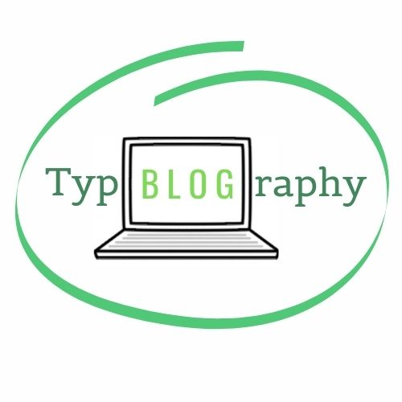

My name is Rebecca Fish, I am a student at Oxford Brookes Univeristy studying Media, Journalism and Publishing. This website is part of my module focusing on typography so I hope to give some information on all things typeface and fonts!

For my branding I decided to choose a green colour palette with white and black details. I believe green is a colour I associate with education and learning which is the purpose of this blog, to teach my readers. It is a calm colour and isn't over whelmingly bright when displayed on a screen,which can be jarring for some. By using different tones of the same colour it helps maintain an idea of coherence with no stark contrasts which can be unappealing with non-complimenting colours. 

#### Banner

For my banner I used two character illustrations to represent my readers, one using a laptop, the other using a phone to show the different ways to access the site depending on preference. The arrow sign on the right side represents just four of the thousands of typefaces available indicating different meanings they can create. 

#### Logo

My logo again uses the green and white tones to show the unitiy with the banner. I used the typeface 'Belgrano' for the letters 't,y,p,r,ap,h,y' which was serifed so it was more traditional and associated more to handwriting and personalisation. To contrast this, the 'Oswald' font was used for the letters 'B,L,O,G' which is sans-serif, capitalised and has a taller x-height, allowing it to look more computerised and typed which is more modern. This is also why I placed these letters within a computer to emphasise the differences in typefaces, modern vs traditional and the ways they can be created. I used different colours as well to emphasise the 'blog' aspect to demonstrate the sites purpose, as well as reveal the pun from the word 'Typography'.

#### Favicon

My favicon is a simplified version of the logo. Because a favicon is so small and much harder to see, more definitive shapes are more useful. It would be difficult to read the word 'typblography' and dicipher that the image was a small laptop therefore I just enlarged the letter T in the same "Belgrano' typeface in the logo and kept the drawn circle which represents the script, handwritten typefaces, linking the two icons together. 

